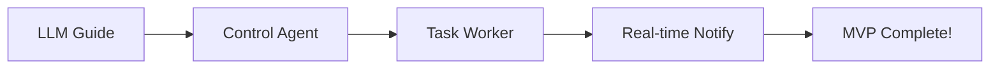

# Next Steps - Quick Reference

## What We Just Completed ✅

- PostgreSQL database setup with Docker
- Complete database schema with full-text search
- PostgreSQL storage backend implementation
- Backend abstraction (can switch between JSON/Postgres)
- MCP tools configuration
- Comprehensive testing (all tests passing)

## What to Work on Next (In Order)

### 🔥 IMMEDIATE (Today/Tomorrow)

#### 1. Test MCP Tools (30 minutes)
**Why**: Verify we can use natural language to interact with database
**How**:
```bash
# Start client and try MCP commands
# "Show me all sessions in the database"
# "Create a new session called test_123"
# "Query the agents table"
```

#### 2. Build Session CLI Tool (2 hours)
**Why**: Need easy way to manage sessions without writing code
**What**:
- Create `session_cli.py`
- Commands: `create`, `list`, `show`, `delete`
- Use argparse for nice CLI interface

**Example**:
```bash
python session_cli.py list --status active
python session_cli.py show morning_meeting_001
python session_cli.py create voice_001 --title "Voice Session"
```

#### 3. Create LLM Prompt Guide (2 hours)
**Why**: This is THE KEY DOCUMENT - tells LLMs how to use our system
**What**: Create `docs/LLM_SESSION_API.md` with:
- How to create sessions
- How to send conversation chunks
- How to store memories
- How to delegate tasks
- Example payloads for each command

**Impact**: Once this exists, you can paste it into ChatGPT/Claude and they'll know how to use the system!

---

### ⚡ HIGH PRIORITY (This Week)

#### 4. Control Agent - Background Agent Spawner (4 hours)
**Why**: THIS IS THE CORE FEATURE - enables LLM to delegate work
**What**: Create `control_agent.py` that:
- Polls task queue
- Claims tasks using `claim_task()` function
- Spawns Claude Code/Codex/Gemini as subprocess
- Captures output and stores results

**Example**:
```python
# LLM creates task via webhook
{
  "command": "delegate_task",
  "session_id": "voice_001",
  "data": {
    "agent_name": "claude_code",
    "task_type": "code",
    "task": "Build a React dashboard component"
  }
}

# Control agent:
# 1. Claims task from DB
# 2. Spawns: claude-code --task "Build React dashboard"
# 3. Waits for completion
# 4. Stores result as artifact
```

#### 5. Task Queue Worker (3 hours)
**Why**: Makes the control agent run continuously
**What**:
- Continuous polling loop
- Respects concurrency limits
- Handles multiple agents
- Updates heartbeat

---

### 📋 MEDIUM PRIORITY (Next Week)

#### 6. Real-Time Task Notifications (3 hours)
**Why**: LLM needs to know when background work completes
**What**: Use Postgres LISTEN/NOTIFY to send webhooks when tasks complete

#### 7. End-to-End Testing (1 hour)
**Why**: Verify entire flow works
**What**:
- Start relay server
- Start client
- Send webhook from ChatGPT simulator
- Verify session created
- Verify task delegated and executed
- Verify results returned

#### 8. Webhook Examples (1 hour)
**Why**: Easy copy-paste testing
**What**: Create `examples/` with JSON files for each command

---

## The Critical Path to MVP

To achieve the **core vision** (LLM delegates work during voice conversation):



**Timeline**: ~15 hours of focused work

**What you get**:
1. Talk to ChatGPT voice mode
2. ChatGPT sends webhook: "Research competitor pricing"
3. Control agent spawns background researcher
4. Results stored in database
5. ChatGPT gets notified and continues conversation

---

## Today's Recommended Focus

If you have **2-3 hours today**, do this:

1. **Test MCP tools** (30 min) - Verify infrastructure
2. **Build Session CLI** (2 hours) - Get hands-on with system
3. **Start LLM Guide** (30 min) - Begin documenting API

This gives you:
- ✅ Confidence everything works
- ✅ Easy session management
- ✅ Foundation for LLM integration

---

## Quick Commands Reference

### Start Infrastructure
```bash
# Start database
docker compose up -d postgres

# Check status
docker compose ps

# View logs
docker compose logs -f postgres
```

### Test Database
```bash
# Connect to DB
docker compose exec postgres psql -U webhook_user -d ai_webhook

# Query sessions
SELECT id, title, status FROM sessions;

# Query tasks
SELECT id, agent_name, status FROM tasks;
```

### Run Tests
```bash
# Test Postgres backend
python test_postgres_backend.py

# Test client
cd client
python client.py
```

### Development Workflow
```bash
# Terminal 1: Database
docker compose up postgres

# Terminal 2: Relay Server
python app.py

# Terminal 3: Client
cd client && python client.py

# Terminal 4: Testing
curl -X POST http://localhost:8000/webhook \
  -H "Content-Type: application/json" \
  -d @examples/create_session.json
```

---

## Decision Points

### Do we need to migrate JSON data?
- Check if `sessions/` directory exists and has data
- If yes: Build migration script (1 hour)
- If no: Skip and move forward

### Which agent to implement first?
**Recommendation**: Start with Claude Code
- You already have it installed
- Easy to spawn with `claude` command
- Can test with simple tasks

### When to deploy to production?
**Recommendation**: After Phase 3 (control agent working)
- Get core functionality working locally first
- Then move to production Postgres
- Then add monitoring/backups

---

## Success Criteria

### Week 1 Success
- [ ] MCP tools tested and working
- [ ] Session CLI built and functional
- [ ] LLM API guide complete
- [ ] Can create/manage sessions easily

### Week 2 Success
- [ ] Control agent spawns background agents
- [ ] Tasks execute and results stored
- [ ] Can delegate work from webhook
- [ ] Basic agent orchestration working

### Week 3 Success
- [ ] Real-time notifications working
- [ ] Full end-to-end flow tested
- [ ] Multiple concurrent sessions working
- [ ] Production-ready

---

## Questions to Consider

1. **Which LLM app will you test with first?**
   - ChatGPT voice mode?
   - Claude mobile app?
   - Desktop app?

2. **What's the first real use case you want to test?**
   - "Research this topic and create a report"?
   - "Build a React component"?
   - "Analyze this conversation and extract action items"?

3. **Do you want to test with mock agents first?**
   - Could create simple mock agent that just returns test data
   - Faster iteration before integrating real Claude Code

4. **What's your deployment target?**
   - Railway (already using for relay)?
   - Render?
   - AWS?
   - Local machine for now?

---

## Resources Created

- `TASK_ROADMAP.md` - Comprehensive task breakdown
- `POSTGRES_IMPLEMENTATION.md` - Database implementation details
- `DATABASE_SETUP.md` - Database setup guide
- `NEXT_STEPS.md` - This file
- `test_postgres_backend.py` - Test suite

**All documentation is in the repo for reference!**
